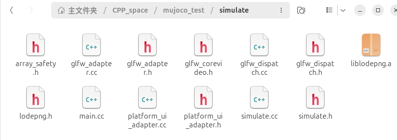
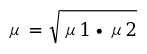
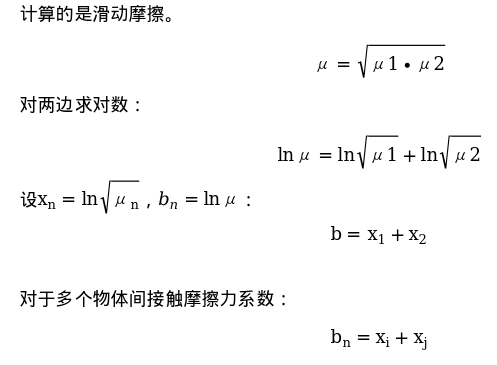
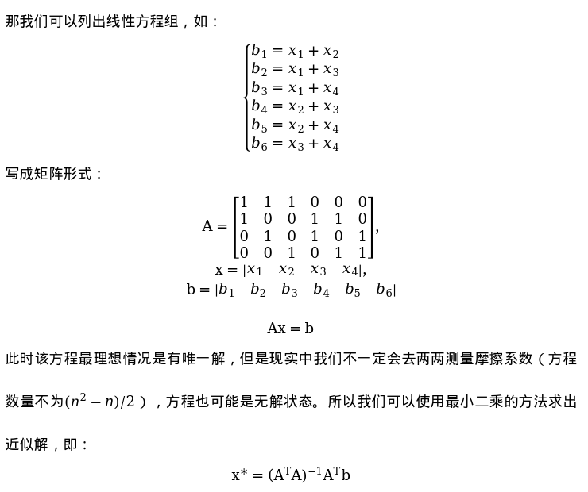

# 仿真环境——MUJOCO

MuJoCo是一个带有 CAPI的 C/C库，面向研究人员和开发人员。运行时模拟模块被调
优为最大限度地提高性能，并对由内置 XML解析器和编译器预先分配的低级数据结构进
行操作。用户使用原生的MJCF场景描述语言定义模型–这是一种设计为尽可能具有人类
可读性和可编辑性的 XML文件格式。也可以加载 URDF模型文件。该库包括带有原生
GUI的交互式可视化，在 Opengl中渲染。MuJoCo进一步公开了大量用于计算与物理相
关的量的效用函数。MuJoCo可用于实现基于模型的计算，如控制综合、状态估计、系统
辨识、机构设计、通过逆动力学进行数据分析，以及用于机器学习应用的并行采样。它还
可以用作更传统的模拟器，包括游戏和交互式虚拟环境。学习MuJoCo主要有两个方面，
一个是 mujoco的模型文件MJCF，一个是开发接口。

## 一、MuJoCo安装

进入 [mujoco项目地址](https://github.com/google-deepmind/mujoco)
若要查看文档在：[mujoco文档地址](https://mujoco.readthedocs.io/en/latest/programming/#building-mujoco-from-source)

### 源码编译安装
参考 mujoco文档安装，找到下图   

**mujoco** 安装教程
克隆 mujoco项目
`git clone https://github.com/google-deepmind/mujoco.git`
创建 build文件夹
`cd build`
编译
```
cmake ..
cmake --build .
```
选择安装位置
`cmake-DCMAKE_INSTALL_PREFIX=/opt/mujoco .`
安装
`sudo cmake --install .`
安装测试
进入 build/bin中，在终端输入
`./simulate ../model/humanoid.xml`
出现以下窗口则安装成功

<font color=Red>如果编译失败出现了 cmake的 fetchcontent相关的问题应该是网络问题，建议使用代理。</font>

### Release版安装
除了编译安装还可以使用官方提供的release版本 
中


选择对应版本即可，这里选择下载 mujoco-x.x.x-linux-x 86_64.tar.gz，下载完解压即可。

## 二、MJCF文件（仿真建模）
MJCF文件就是 mujoco规定的一种 xml文件格式仿真模型文件。用来储存仿真模型和仿真世界。
首先我们先来认识仿真世界的几个重要组成部分。
**仿真世界都具有 环境 和 模型 这两个大部分。**
世界中有地面，背景，灯光，风，重力，地磁等。
模型中包含你要仿真的机器人的躯干，关节，材质，传感器等。

<center>mujoco仿真画面</center>

```
现在我们开始写 MJCF文件。以下是 mujoco文件中元素出现情况：
! 必需的元素，只能出现一次
? 可选元素，只能出现一次
* 可选元素，可以出现多次
R 可选元素，可以递归出现多次
```


### MuJoCo根节点
首先写一个 mujoco节点，这是MJCF文件的根节点，环境和模型都写到这个节点中。<font color=Crimson>该节点一个文件只能存在一个！</font>
例：
`<mujoco model="模型名称"
</mujoco>`


### compiler 世界属性节点
<font color=DarkCyan>*compiler 节点包含在 mujoco 节点中*</font>
compiler 节点主要是仿真的一些运行参数，比如计算方式，材质获取等，如下：

#### compiler 主要配置参数
**angle="radian/degree"（弧度制/角度制）**
**autolimits= [false, true],true**：
&emsp;&emsp;默认开启，则不需要手动指定forcelimited、ctrllimited 和 actlimited，mujoco会根据他们的对应的range参数自动推断出来；如果该参数设置为false则需要手动指定对应的limited 
<font color=Green>*建议配置：*</font>
`<compiler angle="radian/degree" autolimits="true"/>`
<font color=CornflowerBlue>规定角度单位为弧度制，受力限制可选。角度单位为弧度制是机器人开发的常用单位制。</font>


### option 物理属性节点
<font color=DarkCyan>*option 节点包含在 mujoco 节点中*</font>
option所有参数如下：

#### option 主要配置参数
**timestep="0.01"**
&emsp;&emsp;timestep代表仿真走一步的时间，也就是运行一次之后仿真计算出 timestep时长后的世界，单位秒。默认值0.01。
**gravity="0 0 - 9.81"(重力加速度)
wind="0 0 0"（风在三个方向的速度）
magnetic="0 -0.5 0"（世界磁场，影响磁力传感器）
density="0"（世界所处介质密度，比如水或者空气等，单位kg/m³）
integrator=[Euler/RK 4 /implicit/implicitfast]**
&emsp;&emsp;积分器，默认欧拉，用于仿真世界每步就求解计算，各个优势见下图）
**solver=[PGS,CG,Newton]（求解器配置，默认牛顿法）
iterations="100"（约束求解器最大迭代次数）**
***其他求解器参数：***

<font color=Green>*option 配置演示：*</font>
`<option timestep="0.01" gravity="0 0 - 9.81"/>`
#### 积分器比较：


### visual 可视化节点
<font color=DarkCyan>*visual 节点包含在 mujoco 节点中*</font>
visual节点主要影响可视化效果，参数如下：

#### visual 主要配置参数
**global 节点**
&emsp;&emsp;主要是自由相机fovy`fovy="45"`，自由相继透视投影`orthographic: [false, true]`，opengl渲染线宽`linewidth="1"`，在simulate软件中可视化和真实时间速度比例`realtime="1"`，OpenGL 屏幕外渲染缓冲区的高度（以像素为单位）`offheight="480"`等参数组成。
**quality 节点**
&emsp;&emsp;阴影质量`shadowsize="4096"`，抗锯齿效果`offsamples="4"`，几何体网格密度(渲染精度)`numslices="28" numstacks="16" numquads="4"`。
**headlight 节点** 
&emsp;&emsp;headlight是自由相机向前发射的光线。照射环境`ambient="0.1 0.1 0.1"`,rgb漫射分量`diffuse="0.4 0.4 0.4"`,rgb反射分量`specular="0.5 0.5 0.5"`,是否开启`active="0/1"`。
**map 节点**
&emsp;&emsp;影响鼠标交互。
<font color=Green>*visual 配置演示：*</font>
```
<visual>
<quality shadowsize="16384" numslices="28" offsamples="4"/>
<headlight active="1"/>
</visual>
```
shadowsize=" 16384 "（阴影质量，阴影分辨率），numslices=" 28 "（网格密
度），offsamples=" 4 "（抗锯齿，越高效果越好）,diffuse=" 0. 4 0. 4 0. 4 "（在
opengl显示中的漫射程度）

### asset 资源节点
<font color=DarkCyan>*asset 节点包含在 mujoco 节点中*</font>
asset节点主要关于材质，资源等，参数如下:


**mesh 网格节点**
&emsp;&emsp;mesh是网格资源，可以通过二进制STL文件、OBJ文件或MSH文件加载，mujoco也也可以用点云自定义网格面。mesh节点通过name参数传递三维网格给 gemo（几何体）节点用来构建不同形式的几何体。默认加载模型单位是米，有些时候我们使用的stl的尺寸会非常大，这可能是没有单位变化过的模型，需要使用使用 scale 参数进行缩小1000倍。
**name=""（用来索引）**
<font color=Red>在通过文件加载模型的时候mesh的name会默认为文件名，此时可以不需要指定name。</font>
<font color=Green>*点云网格（金字塔）演示：*</font>
`<mesh name="tetrahedron" vertex=" 0 0 0 1 0 0 0 1 0 0 0 1"/>`
这里三个参数为一组点坐标
<font color=Green>*从模型加载网格演示：*</font>
`<mesh file="forearm.stl" scale="0.001 0.001 0.001"/>`

**hfield 节点**
hfield是高度场，直观看就是下面这张图，呈三维场形式，这个可以对复杂地形进行模拟

&emsp;&emsp;应用高度场和mesh一样也是在几何体中加载。
**file="path.png"（加载PNG图片,彩色的会转成灰度，根据灰度信息生成高度）**
**size="0 0 0 0"（场的尺寸，radius_x，radius_y，elevation_z，base_z，可
以理解场 X方向大小，Y方向大小，最高海拔，灰度会映射到[0,-1]，elevation则是实际高度，base_z是基底高度）**
<font color=Green>*高度场加载演示：*</font>
`<hfield name="terrain" file="dixing.png" size="20 20 1.5 0.1"/>`
**这张图是吉林省地形高度图，通过这张图可以生成以下地形。**


**texture 纹理资源节点**
&emsp;&emsp;texture负责纹理资源，可以使用mujoco的和外部加载纹理。天空盒纹理也是该属性。
&emsp;&emsp;纹理数据可以从PNG文件加载，除了PNG之外，还支持第二种文件格式来加载纹理。这是一种自定义二进制文件格式，包含以下数据：
```
(int32)   width
(int32)   height
(byte)    rgb_data[3*width*height]
```
&emsp;&emsp;由于很多情况下用不上那么多，这里简写常用的。
**name=""（用来索引）**
**type="2d/cube/skybox"**
&emsp;&emsp;2d是平面网格纹理，只适合平面
&emsp;&emsp;cube是纹理将模型包裹起来
&emsp;&emsp;skybox是天空盒纹理，天空盒不需要和几何体配合使用，直接再 asset中配置好即可）
**file=""（加载纹理文件）**
gridlayout=""（天空盒纹理
加载，文档更详细）
**builtin="none/gradient/checker/flat"**
用来生成程序化纹理
&emsp;&emsp;none就要自己加载
&emsp;&emsp;gradient是rgb1 过渡到 rgb2
&emsp;&emsp;checker是rgb1 和 rgb2 在2*2网格交替
&emsp;&emsp;flat是 rgb1 填充，但是当 type为 cube和skybox时用rgb2填
充
**width和 height（都是程序化纹理用的，加载纹理不需要**
**nchannel="3"（加载纹理通道数量，允许4通道）**
<font color=Green>*天空盒贴图式样（此为官方文档中图片）：*</font>

`<texture type="skybox" file="./png/desert_sky.png" gridlayout=".U..LFRB.D.." gridsize="3 4"/>`
<font color=Green>*程序化天空盒：*</font>
`<texture type="skybox" builtin="gradient" rgb1="1 1 1 "rgb2="0.6 0.8 1" width="256"height="256"/>`
<font color=Green>*地板演示（地板要用几何体构建）：*</font>
```
<texture name="grid" type="2d" builtin="checker" width="2048"
height="2048" rgb1=".3 .4 .8 "rgb2 =".9 .9 .9"/>
<material name="plane" reflectance="0.3" texture="plane" texrepeat="11" texuniform="true"/>
<geom name="ground" type="plane" size="100 100 0.01" material="grid"/>
```
<font color=Red>*geom节点要在worldbody中*</font>
<font color=Green>*加载材质演示：*</font>
`<texture name="texture1" type="none" nchannel="4" file="path.png"/>`

**material 材质节点**
&emsp;&emsp;mesh和hfield是对几何体的构造，而material则是对几何体表面的构造。mesh和 hfield是几何体的类型，而material就是几何体的属性，几何体可以直接加载material。
**name=""（用来索引）**
**rgba="0 0 0 0"**
&emsp;&emsp;四通道色彩
**specular="0.5"**
&emsp;&emsp;镜面反射程度[0,1]，有色物体反射的光是物体颜色，这个也就是物体颜色的反射程度
**shininess="0.5"**
&emsp;&emsp;亮度[0,1]
**reflectance="0"**
&emsp;&emsp;反射率[0,-1]
**metallic="0"**
&emsp;&emsp;数值高就接近金属质感,mujoco 自己渲染不出来
**roughness="0"**
&emsp;&emsp;越高越粗糙,,mujoco自己渲染不出来
**emission="0"**
&emsp;&emsp;向外发光程度，发射的是材质光
**texture=""**
&emsp;&emsp;指定texture
<font color=Green>*material演示：*</font>
```
<texture name="plane" type="2d" builtin="checker" rgb1 =".2 .3 .4" rgb2 ="0.1 0.15 0.2" width="512" height="512" mark="cross"
markrgb=".8 .8 .8"/>
<material name="plane" reflectance="0.3" texture="plane" texrepeat="11" texuniform="true"/>
```

### default 默认参数节点
<font color=DarkCyan>*default 节点包含在 mujoco 节点中*</font>
建议看完下一个的gemo之后再看这段。


default用来构造默认参数，和编程语言相同，子类会继承父类的参数,在文件中
mujoo根下default只能有一个，但是内部可以继承嵌套如：
<defaultclass="parent">
<geommaterial="metal_material"size=" 333 "/>
<defaultclass="child">
<geomrgba=" 0101 "size=" 0. 50. 50. 5 "/>
</default>
</default>
在这个例子中：parent这个类中几何体属性为<geom material="metal_material"
size=" 3 3 3 "/>子类 child 继承 parent 属性，那么它的几何体为<geom
material="metal_material"rgba=" 0101 "size=" 0. 50. 50. 5 "/>那么现在的几何
体默认属性变为 parent的参数，指定哪个类就是哪个类的参数，没指定的按照默认

（parent）的方式构造。
<geomtype="box"/>
<bodychildclass="su">
<geomtype="ellipsoid"size=" 111 "/>
<geomtype="sphere"size=" 1 "class="parent"rgba=" 0011 "/>
<geomtype="cylinder"pos=" 333 "/>
</body>
现在来看box参数为 parent，ellipsoid参数为 su覆盖 size，sphere为 parent
覆盖 size及 rgba,cylinder参数为su+pos

### worldbody 世界节点
worldbody是 mujoco世界的根，世界之源，承载仿真世界的节点，任何要仿真的
物体都要写道 worldbody节点中。worldbody内部大致如下图：

### geom 几何体节点 
<font color=DarkBlue>*default 节点包含在 mujoco 节点中*</font>


**name=""（用来索引）**
**type="[plane/hfield/sphere/capsule/ellipsoid/cylinder/box/mesh/sdf]"（具体配置见下表）**
**size="0 0 0"（具体配置见下表，跟随type）**
**condim="[ 1 / 3 / 4 / 6 ]"（见下表）**
**contype="0"（碰撞类型） conaffinity="1"（可碰撞对象类型）**
&emsp;&emsp;每个几何体都有一个碰撞类型（contype），这是几何体的属性，conaffinity是几何体可以和什么类型的几何体发生碰撞。contype和conaffinity都是一个32位的掩码。如2->10,3->11。
**material="xxx"**
&emsp;&emsp;材质名
**rgba="0 0 0 0"**
&emsp;&emsp;几何体颜色,四通道
**friction="10 .0050 .0001 "**
&emsp;&emsp;滑动，扭矩，滚动摩擦系数，详细计算在后面章节
**mass=""**
&emsp;&emsp;质量，单位 kg，它和密度只能有一个
**density=""**
&emsp;&emsp;密度，单位kg/m³，kg，它和质量只能有一个
**shellinertia=[true/false]**
&emsp;&emsp;开了就是质量集中在边缘，关了就是均匀密度，主要会影响转动惯量计算
**fromto="0 0 0 0 0 0"**
&emsp;&emsp;按照向量的方式决定几何体的长度和姿态，只能用于capsule、box、cylinder和ellipsoid，前三个是point1，后三个point2几何体的Z轴正方向为point2->point1,长度则为该向量模长
**pos="0 0 0"**
&emsp;&emsp;位置，对于上一级的坐标系
**quat, axisangle, xyaxes, zaxis, euler（表示姿态）**
&emsp;&emsp;quat是四元数,参数为w,x,y,z
&emsp;&emsp;euler是欧拉角，参数为x,y,z
**fluidshape="[none/ellipsoid]"**
&emsp;&emsp;椭球体近似的几何级流体
**fluidcoef="0.5 0.25 1.5 1.0 1.0"**1
&emsp;&emsp;流体相互作用模型的无量纲系数，这个只能看文档
<font color=Darkorange>*type和 size对应关系：*</font>
| Type     | size参数量 |   size参数描述    |
| ---------| ------|------ |
| plane    | 3     |X 半长;Y半长;渲染时网格线间距。如果 X half-size或 Y half-size 为 0，则平面在尺寸为 0 的维度中呈现为无限|
| hfield   | 0     |将忽略几何大小，并改用高度字段大小|
| sphere   | 1     |球体的半径|
| capsule  | 1 or 2|胶囊两侧半球半径;不使用 fromto 时cylinder部分的半长|
| ellipsoid| 3     |X半径;Y 半径;Z 半径|
| cylinder | 1 or 2|圆柱体半径;不使用 fromto 时的半长|
| box      | 3     |X半长;Y半长;Z半长|
| mesh     | 0     |将忽略几何尺寸，改用网格尺寸|

<font color=Darkorange>*condim参数描述：*</font>
|condim	|Description|
|-|-|
|1|	无摩擦接触|
|3|	有规律的摩擦接触，在切线平面上有相反的滑移|
|4|	摩擦接触，切线平面的反向滑移和围绕接触法线的旋转。这是 可用于对软接触进行建模（与接触穿透无关）|
|6|	摩擦接触、切线平面内的反滑移、围绕接触法线旋转和旋转 围绕切线平面的两个轴。后一种摩擦效应有助于预防 无限滚动的对象|

<font color=Red>*更高级的接触仿真的约束求解部分过于复杂，不适合在此处解释，为 solref,solimp，margin,gap多个属性共同作用*</font>
<font color=Green>*地板(plane)演示：*</font>
```
<texture name="grid" type="2d" builtin="checker" width="2048" height="2048" rgb1 =".3 .4 .8" rgb2 =".9 .9 .9"/>
<geom name="ground" type="plane"s ize="100 100 0.01" material="grid"/>
```
<font color=Green>*球体演示：*</font>
`<geom type="sphere" material="metal_material" size="1" mass="1"/>`
<font color=Green>*胶囊/圆柱演示：*</font>
`<geom type="capsule/cylinder" material="metal_material" size="12" mass="1"/>`
<font color=Green>*立方体/椭球演示：*</font>
`<geom type="box/ellipsoid" material="metal_material" size="1 2 1" mass="1"/>`
<font color=Green>*自定义网格演示：*</font>
```
<msh file="forearm.stl"/>
<geom type="mesh" mesh="forearm" material="metal_material"/>
```

### site 节点

简易版 geom，不作为碰撞体积和质量计算，只能使用简易几何体。
用于在某些小部位安装传感器或者小结构渲染等，其属性和 geom非常相近。
### body 节点
<font color=DarkBlue>*default 节点包含在 mujoco 节点中*</font>

### body、gemo和joint
&emsp;&emsp;在运动仿真过程中我们要实现整个机器人模型，也就是身体（骨骼+关节）拼接出来及对应 body，gemo和joint，多个 body嵌套就是机器人整体，整体也是呈树状嵌套。
&emsp;&emsp;在添加joint之前我们先学习一下 mujoco中 body的坐标树规则，这个和ros的tf树很像，可以类比。机器人对于世界有一个坐标，机器人每个坐标系都是基于上一个坐标系的相对位置，其中 body在循环嵌套，每一层中的 gemo都是对于这一层的 body的相对位置，每个 body的坐标都是对于上一个 body的相对位置。这和 tf树模式几乎差不多，就如下图一样：


<font color=Green>*嵌套演示：*</font>
```
<body name="support" pos="0 0 1">
<geom type="cylinder"mass="100"size="0.05 0.5"rgba="0.2 0.2 .2 1"/>
<geom type="sphere" pos="000" mass="100" size="0.1"rgba="0 0 1 1"/>
<body name="motor" pos="0 0 0.5">
<geom type="sphere" mass="100" size="0.1" rgba="1 1 1 1"/>
<body name="motor2" pos="0 0 0">
<geom type="cylinder" mass="100" size="0.1 0.1"rgba=".5 .5 .5 1"/>
</body>
</body>
</body>
```

坐标之后就是运动的核心——joint。
#### joint** 属性
&emsp;&emsp;joint将 body之间连接在一起，使其可以进行活动。这么说吧,一个body中的所有geom为一个整体然后joint是连接这些整体的。就是body和body之间想要活动靠joint。body中只能有一个joint用来连接当前body和上一层body。joint对于上一层body是相对静止的，当前body与joint是在运动。
**name=""（用来索引）**
**tpye="[free/ball/slide/hinge]"**
&emsp;&emsp;自由关节，一般不用
&emsp;&emsp;球形关节，绕球旋转
&emsp;&emsp;滑轨，直线关节
&emsp;&emsp;旋转关节，电机
**pos=" 000 "**
&emsp;&emsp;关节在body的位置
**axis=" 001 "**
&emsp;&emsp;x,y,z活动轴，只有slide和hinge有用
**stiffness=" 0 "**
&emsp;&emsp;弹簧，数值正让关节具有弹性
**range="0 0"**
&emsp;&emsp;关节角度/距离/范围限制，当球形时只有二参有效，一参设置为0，但是要在 compiler指定autolimits），limited="auto"(此属性指定关节是否有限制)
**damping="0"**
&emsp;&emsp;关节阻尼
**frictionloss="0"**
&emsp;&emsp;关节摩擦损失

<font color=Green>*下面是旋转倒立摆建模演示：*</font>
```
<!--支撑柱-->
<body name="support"pos="0 0 0.1">
<geom type="cylinder" mass="100" size="0.05 0.5"rgba="0.2 0.2 0.2 1"/>
<!--水平杆-->
<body name="rotay_am" pos="0 0 0.5">
<joint type="hinge" name="pivot" pos="0 0 0" axis="0 0 1" damping="0.01" frictionloss="0"/>
<geom type="capsule" mass="0.01" fromto="0 0 0 0.2 0 0" size="0.01" rgba="0.8 0.2 0.2 0.5"/>
<!--摆-->
<body name="pendulum" pos="0.2 0 0">
<joint type="hinge" name="ph" pos="0 0 0" axis="100" damping="0.01" frictionloss="0"/>
<geom type="capsule" mass="0.005" fromto="0 0 0 0 0 -0.3" size="0.01" rgba="0.8 0.2 0.2 1"/>
<!--配重-->
<geom type="sphere" mass="0.01" size="0.03" pos="0 0 -0.3" rgba="0.2 0.8 0.2 1"/>
</body>
</body>
</body>
```

### light 灯光节点


**name=""（用来索引）**
**mode=[fixed/track/trackcom/targetbody/targetbodycom]**
&emsp;&emsp;fixed在某处固定光
&emsp;&emsp;tarck追踪物体的 trackcom几乎差不多
&emsp;&emsp;targetbody跟着body一起动的
**target=""**
&emsp;&emsp;跟踪的目标
**directional=[false/true]**
&emsp;&emsp;true是定向的光，就像场一样，定向平行光；false就是聚光灯，和车灯一样
**castshadow="[true/false]"**
&emsp;&emsp;照射物体有没有影子
**active="bool"**
&emsp;&emsp;是否能控制开关灯**
**pos="0 0 0"**
**dir="0 0 0"**
&emsp;&emsp;方向
**attenuation="0 0 0"**
&emsp;&emsp;衰减系数,置 0 和 1 为没有光。[0,1]范围内越大越衰
减
**cutoff="0"**
&emsp;&emsp;聚光灯截止（最大）角度，角度制
**exponent="0"**
&emsp;&emsp;聚光灯汇聚光程度，数值越大光线角度越小
**ambient="0 0 0"**
&emsp;&emsp;颜色，亮度也算是这个
**diffuse="0.7 0.7 0.7"**
&emsp;&emsp;漫射颜色
**specular="0.3 0.3 0.3"**
&emsp;&emsp;反射颜色
<font color=Green>*定向光演示：*</font>
```
<light directional="true" ambient="111 "pos=" 005 "dir=" 00 - 1 " diffuse=" 111 "specular=" 111 "/>
```
<font color=Green>*车灯演示：*</font>
```
<light pos="0.1 0.02" dir="10 0 -1" ambient="1 1 1" cutoff="60" exponent="0" mode="targetbody" diffuse="1 1 1" specular=" 1 1 1"/>
```
<font color=Green>*跟踪物体打光：*</font>
```
<light name="light2arm" castshadow="true" mode="targetbody" target="armor0" diffuse="1 0 0" specular="1 0 0" ambient="1 0 0" cutoff="1" exponent="0" pos="2 2 1"/>
```

### actuator 驱动器节点
<font color=DarkCyan>*actuator 节点包含在 mujoco 节点中*</font>
这是 mujoco中运动控制的节点，在这里指定驱动器，给机器人加入肌肉。

#### general 通用驱动器


&emsp;&emsp;general驱动器类似编程语言中的父对象，后面很多驱动器继承该驱动器的属性，建模的时候不要使用该驱动器。name，class，group
**ctrllimited=[false/true/auto]**
&emsp;&emsp;控制限制，指对驱动器输入值限制，默认 auto
**ctrlrange="0 0"**
&emsp;&emsp;控制范围
**forcelimited==[false/true/auto]**
&emsp;&emsp;驱动器输出力范围
**forcerange="0 0"**
&emsp;&emsp;力范围
**actlimited==[false/true/auto]**
&emsp;&emsp;驱动器活动范围
**actrange="0 0"**
&emsp;&emsp;活动范围，如平面关节为角度范围，默认单位按照设置单位**lengthrange="0 0"**
&emsp;&emsp;活动长度范围，模拟肌肉用到的
**cranklength="0"**
&emsp;&emsp;用于滑块曲柄，设置连杆长度，先建立连杆结构的几何体，之后直接将组合几何体给到 cranksite
**cranksite="string"**
&emsp;&emsp;指定曲柄滑块机构
**gear="100000"**
&emsp;&emsp;对力进行缩放第一个参数有效，其余是joint、
jointinparent和site用的，先不用管
**tendon="string"**
&emsp;&emsp;肌腱，抽象控制器组合，比如双轮同时控制，多个控制器合成一控制输入
**dynprm，gainprm，biasprm**
这些参数都是任意数量
&emsp;&emsp;激活动态参数,表现为阻尼或者响应
&emsp;&emsp;增益参数，表现为映射或者缩放
&emsp;&emsp;偏置参数，零点偏置

#### motor 驱动器
扭矩控制器，和电机差不多，相当于通用驱动器如下设置：
|Attribute	|Setting|	Attribute|	Setting|
|-----------|-------|------------|---------|
|dyntype	|none	|dynprm	|1 0 0|
|gaintype	|fixed	|gainprm	|1 0 0|
|biastype	|none	|biasprm	|0 0 0|

其他属性继承通用驱动器
<font color=Green>*演示：*</font>
`<motorjoint="joint"name="Torque"/>`
<font color=Green>*等效：*</font>
```
<general joint="joint" name="Torque" ctrlrange="-1 1" dynprm="1 0 0" gainprm="1 0 0" biasprm="0 0 0"/>
```

#### position 驱动器
位置控制伺服，相当于通用的
|Attribute	|Setting	|Attribute	|Setting|
|-----------|-----------|-----------|-------|
|dyntype	|none or filterexact|	dynprm	|timeconst 0 0|
|gaintype	|fixed	|gainprm	|kp 0 0|
|biastype	|affine	|biasprm	|0 -kp -kv|

**kp=" 0 "（反馈增益，比例，相当于输入*kp）**
**kv=" 0 "**
&emsp;&emsp;阻尼，使用这个建议 option中积分器改成 implicitfast或者implicit
**dampratio=" 0 "**
&emsp;&emsp;阻尼比，加了阻尼才能加这个，计算方式为 2 √(kp*m)，值为 1 对应于临界阻尼振荡器，该振荡器通常会产生理想的行为。小于或大于 1 的值分别对应于欠阻尼和过阻尼振荡。小于或大于 1 的值分别对应于欠阻尼和过阻尼振荡
**timeconst=" 0 "**
&emsp;&emsp;大于 0 为一阶滤波器时间常数，等
于 0 不使用滤波器）。inheritrange（看文档）。
<font color=Green>*演示：*</font>
`<position joint="joint" name="pos" kp=" 2 "kv=" 0. 1 "/>`

**inheritrange：**
|inheritrange|	ctrlrange|
|------------|-----------|
|0	|手动设置|
|1.0	|和限制的range一致|
|<1.0	|大于限制|
|>1.0	|小于限制|

&emsp;&emsp;非0/1.0时计算公式：

<font color=Green>*演示：*</font>
`<position joint="joint" name="pos" kp="2" kv="0.1" />`

#### velocity 驱动器
速度伺服控制，等效通用驱动器：
|Attribute|	Setting|	Attribute|	Setting|
|---------|--------|-------------|---------|
|dyntype|	none|	dynprm|	1 0 0|
|gaintype|	fixed	|gainprm|	kv 0 0|
|biastype|	affine|	biasprm|	0 0 -kv|

**kv（速度增益）**
#### intvelocity 驱动器
积分速度伺服：
|Attribute	|Setting|	Attribute|	Setting|
|-----------|-------|------------|---------|
|dyntype	|integrator|	dynprm|	1 0 0|
|gaintype	|fixed|	gainprm|	kp 0 0|
|biastype	|affine|	biasprm|	0 -kp -kv|
|actlimited	|true|		|               |

这里 kp变成速度增益了，kv变为阻尼。
inheritrange同上position

#### damper 驱动器

产生与速度和控制正比的力，建议开建议 option中积分器 implicitfast或者 implicit，
F=-kv*velocity*control,等效：
|Attribute	|Setting|	Attribute|	Setting|
|-----------|-------|------------|---------|
|dyntype	|none	|dynprm	|1 0 0|
|gaintype	|affine|	gainprm|	0 0 -kv|
|biastype	|none	|biasprm|	0 0 0|
|ctrllimited|	true|		||

#### cylinder 驱动器

气缸和液缸模拟：
|Attribute|	Setting|	Attribute|	Setting|
|---------|--------|-------------|---------|
|dyntype|	filter|	dynprm|	timeconst 0 0|
|gaintype|	fixed|	gainprm|	area 0 0|
|biastype|	affine|	biasprm|	bias(3)|

**timeconst=" 1 "（时间常数）**
**area=" 1 "（圆柱体面积，输出增益）**
**diameter=""（指定为直径，比面积优先）**
**bias=" 000 "（偏置）**

<font color=Green>*演示：*</font>
``
<actuator>
<position joint="rfd" name="rfdp" kp="2" kv="0.1"/>
<motor joint="rfa" name="rfav"/>
</actuator>
``


###  replicate 复制节点（阵列排布）
&emsp;&emsp;mujoco中的阵列排布可以是圆周阵列和直线阵列，就像我们在常见的建模软件中的阵列一样，首先需要一个实体，可以是 body或者是 geom，然后我们要确定圆形，半径，排列数量，相距角度等。
**count="0"**
&emsp;&emsp;阵列数量
**euler="0 0 0"**
&emsp;&emsp;围绕三个轴阵列，参数为两个实体相隔角度，角度单位为 compiler中定义的
**sep=""**
&emsp;&emsp;名字分隔，阵列的实体名字会是原来的 name+编号,如果sep有字符，则是 name+sep+编号
**offset="0 0 0"**
&emsp;&emsp;阵列的坐标偏移，前两个是 xy偏移，第三个是阵列的元素在 z方向上的距离间隔，也就是螺旋上升
<font color=Green>*圆周演示:*</font>
```
<body name="laser" pos="0.25 0.25 0.5">
<geom type="cylinder" size="0.01 0.01"/>
<replicate count="50" euler="0 0 0.1254">
<site name="rf" pos="0.1 0 0" zaxis="1 0 0" size="0.001 0.001 0.001" rgba="0.8 0.2 0.2 1"/>
</replicate>
</body>
```
&emsp;&emsp;这个演示中我们在 body里面圆周阵列了 50 个site，绕 z轴，每个site相隔角度为 0. 1254 pi，阵列半径为site中pos的第一个参数，此时pos不再决定几何体的三维空间位置，而是配合阵列使用。
<font color=Green>*效果:*</font>


## 官方文档演示：


<font color=Green>*直线阵列演示（不加入 euler就是直线阵列,offset作为排布方向和间距）：*</font>
``
<replicate count="4" offset="0 .5 0">
<geom type="box" size=".1 .1 .1"/>
</replicate>
``

### tendon 肌腱节点
&emsp;&emsp;肌腱的作用就是将关节组合映射，可以将多个关节组合成一个控制器进行控制。最简单的用法可以看官方模型的 car.xml。这个模型将左轮和右轮统一映射成了向前和旋转两个控制器对车辆进行控制。如果作为麦轮或者全向轮来说可以分成 x,y,roat这三个控制器。


&emsp;&emsp;tendon有两种组合模式，一种是spatial一种是 fixed。

#### spatial
&emsp;&emsp;使用tendon组合关节驱动的时候，要使用tendon下面的spatial节点。spatial是类似一种像肌肉一样的驱动方式，比如线驱灵巧手等。如下图所示的驱动方式，通过每个site来拉住关节驱动。


&emsp;&emsp;spatial包含name.class,group,limited,rgba
**range="0 0"**
&emsp;&emsp;肌腱长度范围
**frictionloss="0"**
&emsp;&emsp;摩擦损失
**width="0.003"**
&emsp;&emsp;肌腱半径，可视化部分
**springlength="-1 -1"**
**stiffness="0"**
&emsp;&emsp;刚性系数，相当于弹簧的弹力系数
**damping="0"**
&emsp;&emsp;阻尼系数。正值会产生沿肌腱作用的阻尼力（速度线性）。与 通过欧拉方法隐式积分的关节阻尼，则肌腱阻尼不是隐式积分的，因此 如果可能，应使用关节阻尼）。
<font color=Red>*&emsp;&emsp;spatial下包含多个site，用于指定每个固定肌腱的节点。*</font>

<font color=Green>*演示如下：*</font>
```
<body pos="0 0 1">
<site name="ceiling" pos="0 0 0" />
<geom type="sphere" size="0.2" />
<body pos="0 0 0">
<site name="hook1" type="sphere" size="0.03" pos="0.1 0 0.1" rgba="0 1 0 1"/>
<geom type="capsule" size="0.1" fromto="0 0 0 1 0 0" />
<joint name="joint1" type="hinge" axis="0 0 1"/>
<body pos="1 0 0">
<site name="hook2" type="sphere" size="0.03" pos="0.1 0 0.1" rgba="0 1 0 1"/>
<geom type="capsule" size="0.1" fromto="0 0 0 1 0 0" />
<joint name="joint2" type="hinge" axis="0 0 1"/>
<body pos="1 0 0">
<site name="hook3" type="sphere" size="0.03" pos="0.1 0 0.1" rgba="0 1 0 1"/>
<geom type="capsule" size="0.1" fromto="0 0 0 1 0 0" />
<joint name="joint3" type="hinge" axis="0 0 1"/>
<site name="hook4" type="sphere" size="0.03" pos="1.1 0 0.1" rgba="0 1 0 1"/>
</body>
</body>
</body>
</body>
```
<font color=Green>*tendon：*</font>
```
<tendon>
<spatial springlength="0 0.5" stiffness="1000" damping="10" width="0.01" rgba="1 0 0 1">
<site site="ceiling" />
<site site="hook1" />
<site site="hook2" />
<site site="hook3" />
<site site="hook4" />
</spatial>
</tendon>
```

#### fixed**
&emsp;&emsp;使用tendon组合关节映射的时候，要使用tendon下面的fixed节点。fixed中包含关节的映射关系。fixed中joint为制定关节，coed为缩放系数。原理就是使用fixed组合之后，控制器不再使用关节控制，而是将数据传给tendon/fixed，通过code缩放参数后给joint。
<font color=Green>*以下是全向轮模型及控制演示：*</font>
```
<body name="base_body" pos="0 0 1">
<freejoint />
<geom type="cylinder" size="0.5 0.01" rgba=".6 .6 .6 .5" />
<replicate count="4" euler="0 0 1.57">
<body name="om_m" pos="0.6 0 0" quat="0.707107 0 0.707107 0">
<joint name="a_m" type="hinge" axis="0 0 1" frictionloss=".002" />
<geom type="cylinder" size="0.05 0.1" rgba=".1 .1 .1 1" />
<geom type="cylinder" size="0.15 0.045" rgba=".1 .1 .5 .5" />
<body name="mini_wheel1" pos="0 0 0.015" euler="0 0 0.224285714">
<replicate count="14" euler="0 0 0.448571429">
<body euler="1.5707963267948966 0 0">
<joint type="hinge" pos="0.15 0 0" axis="0 0 1"
frictionloss=".00002" />
<geom type="capsule" size="0.01 0.02" pos="0.15 0 0" />
</body>
</replicate>
</body>
<body name="mini_wheel2" pos="0 0 -0.015" euler="0 0 0">
<replicate count="14" euler="0 0 0.448571429">
<body euler="1.5707963267948966 0 0">
<joint type="hinge" pos="0.15 0 0" axis="0 0 1"
frictionloss=".00002" />
<geom type="capsule" size="0.01 0.02" pos="0.15 0 0" />
</body>
</replicate>
</body>
</body>
</replicate>
</body>
```
<font color=Green>*tendon：*</font>
```
<tendon>
<fixed name="forward" frictionloss="0.001">
<joint joint="a_m0" coef=".25" />
<joint joint="a_m1" coef="0" />
<joint joint="a_m2" coef="-.25" />
<joint joint="a_m3" coef="0" /> 
</fixed>
<fixed name="transverse" >
<joint joint="a_m0" coef="0" />
<joint joint="a_m1" coef=".25" />
<joint joint="a_m2" coef="0" />
<joint joint="a_m3" coef="-.25" /> 
</fixed>
<fixed name="roatate">
<joint joint="a_m0" coef=".25" />
<joint joint="a_m1" coef=".25" />
<joint joint="a_m2" coef=".25" />
<joint joint="a_m3" coef=".25" /> 
</fixed>
</tendon> 
```
<font color=Green>*麦克纳姆轮模型同理，以下是麦克纳姆轮A，B轮建模演示：*</font>
```
<body name="Mecanum_A" pos="0.5 0.6 0" euler="1.57079632679 0 0">
<joint name="l_u_m" type="hinge" pos="0 0 0" axis="0 0 1" frictionloss=".000002" />
<geom type="cylinder" size="0.05 0.1" rgba=".1 .1 .1 1" />
<site type="cylinder" size="0.15 0.045" rgba=".1 .1 .5 .5" />
<replicate count="16" euler="0 0 0.3925">
<body euler="-0.78539815 0 0">
<joint type="hinge" pos="0.15 0 0" axis="0 0 1" frictionloss=".000002" />
<geom type="capsule" size="0.015 0.05" pos="0.15 0 0" />
</body>
</replicate>
</body>
<body name="Mecanum_B1" pos="-0.5 0.6 0" euler="1.57079632679 0 0">
<joint name="l_d_m" type="hinge" pos="0 0 0" axis="0 0 1" frictionloss=".000002" />
<geom type="cylinder" size="0.05 0.1" rgba=".1 .1 .1 1" />
<site type="cylinder" size="0.15 0.045" rgba=".1 .1 .5 .5" />
<replicate count="16" euler="0 0 0.3925">
<body euler="0.78539815 0 0">
<joint type="hinge" pos="0.15 0 0" axis="0 0 1" frictionloss=".000002" />
<geom type="capsule" size="0.015 0.05" pos="0.15 0 0" />
</body>
</replicate>
</body>
```

## 三、非刚体（仿真建模）
### composite 复合体 

&emsp;&emsp;复合体可以仿真，body集合，软体，布料，鱼网等。本质上是一堆微小几何体组合形成的新型结构。
**prefix="name"**
&emsp;&emsp;和name相同也就是names，prefix表示整个复合体的命名索引，具体复合体中的body名称为name+B+（坐标），比如坐标为（1,2）那body的name就是nameB1_2）
**type=[particle,grid,cable（代替后两个）,rope（弃用）,loop（弃用）,cloth（弃用，使用 grid代替布料）,box,cylinder,ellipsoid]**
&emsp;&emsp;particle粒子集合
&emsp;&emsp;grid网格 1 D或者 2 D，也代替布料，绳子
&emsp;&emsp;box立方体集合，可以做成软体立方体。
**count=" 000 "**
&emsp;&emsp;复合体的排列数量和方式，分别对应三个方向上的数量）**spacing=""**
&emsp;&emsp;复合体排列中，两个小 body之间距离
**offset=" 000 "**
&emsp;&emsp;相当于整个复合体的空间坐标
**joint=[main,twist,stretch,particle]**
&emsp;&emsp;复合体活动类型
**pin-coord=""**
&emsp;&emsp;复合体固定位置
<font color=Green>*演示：*</font>
**1. 粒子集合**
```
<composite type="particle" prefix="bullet" count="5 5 10" spacing="0.01" offset="1 1 2">
<geom type="sphere" size="0.0084" material="green_grapes" mass="0.0032" />
<joint kind="particle" type="free" />
</composite>
```
&emsp;&emsp;这里是创建了一个 5 * 5 * 10 的小弹丸集合，命名为 bullet，joint添加 particle是给粒
子用的，free就是代表可以自由碰撞。
**2. 绳**
```
<composite type="grid" prefix="C" count="10 1 1" spacing="0.1" offset="1 1 2">
<geom type="sphere" size="0.0084" material="green_grapes" mass="0.0032" />
<joint kind="twist" type="free" />
</composite>
```
&emsp;&emsp;这里可以使用 grid，这是给 1 D和 2 D集合体使用的，可以仿真一节一节类似线的集合。
注意这里 1 D的仿真的 count。joint的 twist是给这类复合体使用的，也可以不加入
joint。

**3. 悬挂鱼网**
```
<composite type="grid" prefix="C" count="10 10 1" spacing="0.1" offset="1 1 2">
<geom type="sphere" size="0.0084" material="green_grapes" />
<pin coord="0 0"/>
<pin coord="0 9"/>
<joint kind="twist" type="free" />
</composite>
```
&emsp;&emsp;这里我们还是使用 grid，创造了一个 10 * 10 的网，网格间距为 0. 1 ,通过 pin的作用是
固定网面上的( 0 , 0 )和( 0 , 9 )点让网悬挂起来。

**4. 布料**
```
<composite type="grid" count="5 5 1" spacing="0.6" offset="0 0 3">
<skin texcoord="true" material="plane" inflate="0.01" subgrid="3" />
<pin coord="0 0" />
<pin coord="4 0" />
<geom size="0.1" />
<joint kind="main" damping="5" />
</composite>
```
&emsp;&emsp;这里仍然使用的是 grid，但是加入了 skin，这可以使整个网的表面联合起来，形成布料
的效果，这里的 count和 spacing会影响布的“密度”，密度越大越不容易活动。
skin中texcoord是影响纹理可视化的，inflate类似厚度，负值可以直接穿过布料。正
值表示布料比较厚，对于碰撞影响较大。subgrid越高渲染等级越高，建议不要大于 3 。

**5. 软体 box**
```
<body pos="0 0 1">
<freejoint/>
<composite type="box" count="5 5 5" spacing="0.1">
<skin texcoord="true" material="number_3" rgba=".7 .7 .7 1"/>
<geom type="sphere" size="0.0084" />
<joint kind="main" solreffix="0.03 1" solimpfix="0 .1 .01"/>
</composite>
</body>
```
&emsp;&emsp;这里的 box可以使用 sphere,ellipsoid和capsule。不使用 skin就是立体粒子集合，

&emsp;&emsp;skin的 material中的 texture加载图片要使用 2 d类型，不要使用 box类型。joint
中的 solreffix和 solimpfix见官方文档的求解器。这个类型要在 body中并且加入
freejoint否则不能自由移动。


## 四、传感器

传感器基础属性为 name,noise（已经没有用了，仅作为标记信息），cutoff（是否绝
对值输出数据）。

### camera
&emsp;&emsp;和light元素很像，就像一个聚光灯一样。相同的配置有name.mode,target.pos,姿态的quat, axisangle, xyaxes, zaxis, euler，这些配置和上面的light一样。下面说明特有配置。（获取相机画面在mujoco接口里面讲解）
***设置相机视野有分为两种：***
**1. fovy=" 45 "（垂直视野，单位度）。**
**2. focal=" 00 "（焦距还对画面的长宽拉伸有影响，长度单位），sensorsize=" 00 "
（传感器尺寸，对畸变影响较大），resolution=" 00 "（分辨率）。**
**focalpixel=" 0 0 "**
&emsp;&emsp;焦距，单位像素
**sensorsize=" 00 "**
&emsp;&emsp;传感器角度
**resolution=" 00 "**
&emsp;&emsp;分辨率
相机中心位置和fovy冲突principal="0 0"（相机中心位置，长度单位），
**principalpixel="0 0"**
&emsp;&emsp;相机中心位置，像素偏移
**ipd="0.068"**
&emsp;&emsp;瞳距，给双目用的
<font color=Green>*演示1：*</font>
```
<camera name="cam2armor" mode="targetbody"  target="armor0" principalpixel="200 200" focalpixel="1280 1080" sensorsize="4 4" resolution="1280 1080"/>
```
<font color=Green>*演示2：*</font>
```
<camera name="cam2armor1" mode="targetbody" target="armor0" fovy="54.225" />
```

### IMU
&emsp;&emsp;imu是常见机器人传感器，在mujoco中没有imu，而是分成了三个传感器（imu本身也是组合传感器），accelerometer（加速度计），velocimeter（线速度仪），gyro（陀螺仪）,这三个传感器都是输出三个数据，分别是x,y,z轴或者方向的数据。只要将这三个组合一下就能得到imu。
在使用传感器的时候一般使用一个 site作为传感器安装位置，然后将传感器的 site
固定到 site上。
&emsp;&emsp;在使用传感器的时候一般使用一个site作为传感器安装位置，然后将传感器的site固定到site上。
<font color=Green>*演示：*</font>
```
<site name="imu" type="box" size="0.02 0.02 0.02"  />
......
<sensor>
<gyro name="gyro" site="imu" />
<accelerometer name="accel" site="imu" />
<velocimeter name="velo" site="imu" />
</sensor>
```

### 关节角度传感器

关节角度直接来自 mjData.qpos
`<jointpos joint="joint_name" name="this_name"/>`
### 关节速度传感器

关节角速度直接来自 mjData.qvel
`<jointvel joint="joint_name" name="this_name"/>`
### 激光测距传感器

&emsp;&emsp;绑定在 site上。不可见或者 rgba中 alpha= 0 的几何体不会被测量到，通过禁用其
geom组而在visualizer中不可见的会被测量。
**激光雷达处理**
&emsp;&emsp;激光雷达可以使用阵列排布传感器，在上面阵列排布中我们已经写完了传感器的阵列，
接下来只需要在传感器中将激光测距传感器绑定在阵列的 site中即可。
`<rangefinder site="rf" />`
3D激光雷达，我们只需要在xyz三个轴上分别阵列排布即可，注意按照现实中的激光雷达参数进行排布。
<font color=Green>*演示：*</font>
```
<body name="laser" pos="0.25 0.25 0.5">
<geom type="cylinder" size="0.01 0.01 " />
<replicate count="20" euler="0.314 0 0">
<replicate count="20" euler="0 0.314 0">
<replicate count="50" euler="0 0 0.1254">
<site name="rf" pos="0.01 0 0" zaxis="1 0 0" size="0.001 0.001 0.001"
rgba="0.8 0.2 0.2 0" />
</replicate>
</replicate>
</replicate>
</body>
```
<font color=Green>*效果：*</font>


<font color=Red>建议：</font>激光雷达在mujoco中计算频率和仿真频率相同，当点云数量较多的时候会严重影响效率，一般激光雷达的反馈频率都比较低，所以建议但开一个线程和模型单独计算激光雷达的点云数据。

### 力传感器（ **force and torque** ）
&emsp;&emsp;这两个都是在body之间作用的，加入力传感器我们可以知道一个body对另一个body的作用力。力传感器通过site安装到body中。
<font color=Green>*演示：*</font>
```
<body pos="0 0 1">
<geom type="box" size=".3 .3 .005" rgba=".2 .2 .2 1"/>
<body name="up_box" pos="0 0 .02">
<site name="force_torque" />
<geom type="box" size=".3 .3 .005" rgba=".3 .3 1 1"/>
</body>
</body>
```
<font color=Green>*sensor：*</font>
```
<sensor>
<force name="force" site="force" />
<torque name="torque" site="torque" />
</sensor>
```

### 球形关节传感器
**ballquat**
&emsp;&emsp;直接指定关节即可，传感器信息是球形关节四元数数据，数据和mjData.qpos一致。
**ballangvel**
&emsp;&emsp;直接指定关节即可，传感器信息是球形关节三个角速度数据，数据和mjData.qvel一致。
<font color=Green>*演示：*</font>
```
<ballquat name="ball" site="ball" />
<ballangvel name="ball" site="ball" />
```

### 相对传感器
**前面带 fram的都是可以获得全局或者相对的传感器数据。**

### 位置传感器

**objtype=[body,xbody,geom,site,camera]**
&emsp;&emsp;传感器链接对象类型，body是全局,xbody是相对坐标
**objname=""**
&emsp;&emsp;传感器链接对象
**reftype=[body,xbody,geom,site,camera]**
&emsp;&emsp;参照系所附加到的对象的类型
**refname=""**
&emsp;&emsp;引用框架所附加到的对象的名称。
&emsp;&emsp;解释：如果指定了 reftype和 refname那么传感器测量的就是相对于 refname的坐标。

### 姿态传感器

这个参数和上面的一样。

### 速度、角速度、加速度和角加速度传感器

这些参数和上面的一样。

### 质心传感器
&emsp;&emsp;subtreecom可以获得body的运动质心的全局坐标。subtreelinvel可以获得body运动质心的线速度，subtreeangmom获得质心角动量。
这些传感器都是两个参数name和body（指定测量body）。

### 初始化

**keyframe** （在mujoco下）

这些参数都是我们在接口中可以直接控制的参数，可以作为初始化输入。
<font color=Green>*演示：*</font>
```
<keyframe>
<key name="initial" ctrl="0 0 -1.57 0 3.14 0 1.57 0" />
</keyframe>
```

## 五、MUJOCO接口（C++）
### 编译安装版使用 mujoco：
1.使用mujoco的C++接口时，要包含头文件。头文件在下载的mujoco文件夹中的include/mujoco中，一共12个文件。或者在安装好的位置中寻找，默认是.mujoco/include/mujoco中，或者指定到了/opt/mujoco。
库文件在build/lib或者.mujoco/lib中。
2.如果是按照上面安装到了/opt/mujoco中可以使用cmake包寻找mujoco
```
set(MUJOCO_FOLDER /opt/mujoco/lib/cmake)
find_package(mujoco REQUIRED PATHS ${MUJOCO_FOLDER} NO_DEFAULT_PATH)
if (mujoco_FOUND)
message(STATUS "Find mujoco")
endif()
```
然后是链接库
`target_link_libraries(your_appmujoco::mujocoglutGLGLUglfw)`
第一种方法需要更改 mujoco的头文件路径，第二种只要如下即可：
`#include<mujoco/mujoco.h>`
mujoco库只要包含 mujoco就行，glut,GL,GLU,glfw是 mujoco进行可视化要使用的
库。
### Release安装版使用 mujoco：
这里只有CMakeLists.txt中寻找库和头文件和上面的操作不同：
```
# 设置 MuJoCo 的路径
set(MUJOCO_PATH "/home/albusgive/software/mujoco")
# 包含 MuJoCo 的头文件
include_directories(${MUJOCO_PATH}/include)
# 设置 MuJoCo 的库路径
link_directories(${MUJOCO_PATH}/bin)
set(MUJOCO_LIB ${MUJOCO_PATH}/lib/libmujoco.so)
```
链接库：
`target_link_libraries(your_app ${MUJOCO_LIB} glut GL GLU glfw)`
**测试环境：**
1 .将 mujoco文件夹中的 simulate的文件夹复制出来，只保留以下文件：

2.liblodepng.a在编译好的mujoco/build/lib中,lodepng.h在mujoco/build/_deps/lodepng-src中,拷到你的simulate中
3 .CMakeLists.txt如下:
```
cmake_minimum_required(VERSION 3.20)
project(MUJOCO_T)
include_directories(${CMAKE_CURRENT_SOURCE_DIR}/simulate)
link_directories(${CMAKE_CURRENT_SOURCE_DIR}/simulate)
set(MUJOCO_FOLDER /opt/mujoco/lib/cmake)
find_package(mujoco REQUIRED PATHS ${MUJOCO_FOLDER} NO_DEFAULT_PATH)
if (mujoco_FOUND)
message(STATUS "Find mujoco: ${mujoco_INCLUDE_DIRS}, ${mujoco_LIBRARIES}")
endif()
file(GLOB SIMULATE_SRC ${CMAKE_CURRENT_SOURCE_DIR}/simulate/*.cc)
add_executable(simulate ${SIMULATE_SRC})
target_link_libraries(simulate mujoco::mujoco glut GL GLU glfw lodepng)
4.编译运行
```
4 .编译运行
```
cmake ..
make
./simulate
```
<font color=Red>编译的时候可能缺GLFW 		使用 sudo apt-get install libglfw3-dev
缺GLUT		使用sudo apt-get install freeglut3-de</font>
&emsp;&emsp;mujoco官方提供的可视化演示有两个，比较全面的是simulate，精简版是basic，代码分别在simulate文件夹和sample文件夹。simulate提供了几乎mujoco中全部接口，但是代码量很大，很复杂。basic仅提供可视化渲染和简单的拖动视角操作。mujoco的可视化要使用opengl渲染，难度和学习量比较大，但是会更灵活。在这里不学习opengl，通过改写官方的basic来进行简单的可视化，其他数据使用ros2或者其他工具分析。如果会使用unity的话还可以交给unity渲染，画面还能再上一步（我不会）。
首先把basic.cc复制一份改成basic.cpp。现在来分析官方的代码。

**声明对象：**
```
mjModel *m = NULL; // 用来加载模型
mjData *d = NULL; //用来储存仿真数据
mjvCamera cam; // 可视化的相机，鼠标交互
mjvOption opt; // 模型文件配置信息
mjvScene scn; // 显示数据
mjrContext con; //GPU渲染
```
那几个函数都是鼠标和窗口交互的，先不用看。
mujoco有两种模型文件。一种是.mjb使用mj_loadModel函数读取，一种就是我们熟悉的xml文件，使用mj_loadXML读取。使用方式看main函数中演示。模型加载好之后通过模型生成data文件：
```
/ load and compile model
char error[1000] = "Could not load binary model";
if (std::strlen(argv[1]) > 4 && !std::strcmp(argv[1] + std::strlen(argv[1]) - 4, ".mjb"))
{
m = mj_loadModel(argv[1], 0);
}
else
{
m = mj_loadXML(argv[1], 0, error, 1000);
}
if (!m)
{
mju_error("Load model error: %s", error);
}
// make data
d = mj_makeData(m);
```
&emsp;&emsp;接下来直接看while循环嵌套，第二个循环while (d->time - simstart <1.0/60.0)，这里是仿真步长，是指一次运行在仿真世界中时间经过多久。d->time - simstart是单次仿真时长。这里演示的时长<1/60也就是一次仿真时间1/60秒。函数中的mj_step(m, d);就是进行仿真计算。当这个while循环结束说明仿真中时间过去了接近1/60秒。我们要在这个循环外面对仿真进行控制和读取数据，不然控制频率会异常高，因为一步step经过时间为option中的timestep（默认值0.002）。这里的时间控制建议大于模型文件，这样能保证仿真的精度和稳定性，timestep越低仿真精度越高。或者不使用这个循环进行控制，直接确定好timestep为多长时间，然后一步mj_step得出结果。
```
while (d->time - simstart < 1.0/170.0){
mj_step(m, d);}
```
&emsp;&emsp;使用这种while循环有它的好处，当想获得比较长的一段时间之后的仿真数据就要用到这个了，比如想获得1秒后的数据，timestep设置为1秒的话仿真计算不出来，那么就应该使用循环来控制仿真时间。

|	|使用while获得仿真之后的时间|	一步step获得|
|---|-----------------------|--------------|
|精度|	单步时间长可以设置更小的步长来获得长时间更精确的仿真|	时间步长越小越精准|
|单步时间长度|	可以很长时间|	不可以很长时间|
|计算量	|步数多计算量大|	计算量小|


再往下看就是 opengl渲染部分了，不做分析。接下来是获取模型数据。


### 获取各实体名称

先看mjModel结构体开头部分，这里的命名方式都是nXXX，这代表各个元素的数量。


&emsp;&emsp;在mjModel中还有一堆变量命名是name_xxx的部分，这就是我们获取各种元素的名称的位置，其中names的类型是char*用来存放name，其余是各个元素的名称的索引。我们可以看到后面的注释，比如name_bodyadr，后面注释说明是body的name的位置的指针。在后面的nbody*1是表示使用body的id进行索引获取，有些可能是比如nbody*n，代表获得到索引之后，后面的n个数据都是需要获取的。
<font color=Green>*演示：*</font>
```
std::cout<<"nbody:"<<m->nbody<<std::endl;
std::cout << "body name:" << m->names + m->name_bodyadr[0] << std::endl;
```
这里通过m->nbody查询body一共有多少个，下面则是打印了第0号body的名称。其他元素获取名称同理。

### 控制

&emsp;&emsp;通过mjData中的ctrl数组进行控制。在base中是d->ctrl[0] = 2;这样的形式。ctrl中对应的是对驱动器——actuator进行输入。具体驱动器的顺序和在模型文件中actuator的顺序一致。还可以通过mjModel中的数据读取驱动器序号、名称以和其他详细数据。
<font color=Green>*演示：*</font>
```
//actuator数量 nu
std::cout<<"nu:"<<m->nu<<std::endl;
//m->name_actuatoradr是储存actuator名称在m->names中的位置
//m->name_actuatoradr[0]是第一个actuator名称在m->names中的位置
std::cout<<"actuator name:"<<m->names +m->name_actuatoradr[0]<<
std::endl;
```
假如我们要对一个电机驱动器进行控制，已知电机驱动器id为0,只需要在mj_step之前将ctrl数组进行赋值即可。经过mj_step就会进行驱动，ctrl数组中的数据不会自动清除，赋值之后会一直按照给定数值执行驱动。
<font color=Green>*演示：*</font>
```
d->ctrl[0] = 2;//2N*M
mj_step(m, d);
```


### 传感器数据获取

接口介绍：
`MJAPI int mj_name2id(const mjModel* m, int type, const char* name);`
通过name获取实体的id，参数二，type是在mjmodel.h文件中的mjtObj中定义，这个是要获取id的实体类型。一下是部分type类型枚举，在mjtObj中找到。

&emsp;&emsp;我们再在mjData结构体中能找到sensordata这个指针，通过传感器索引就能找到对应的传感器数据。

sensordata的索引需要依靠mjData的sensor_adr获取，这个可以使用sensor的id。

&emsp;&emsp;这个我们要注意传感器具有的数据量，有的传感器是一个值，而有的传感器是三个值。我们可以使用mjModel中的sensor_dim获得传感器输出的参数量。
<font color=Green>*演示：*</font>
```
std::vector<mjtNum> get_sensor_data(const mjModel *model, const mjData *data, const std::string &sensor_name)
{
int sensor_id = mj_name2id(model, mjOBJ_SENSOR, sensor_name.c_str());
if (sensor_id == -1)
{
std::cout << "no found sensor" << std::endl;
return std::vector<mjtNum>();
}
int data_pos = 0;
for (int i = 0; i < sensor_id; i++)
{
data_pos += model->sensor_dim[i];
}
std::vector<mjtNum> sensor_data(model->sensor_dim[sensor_id]);
for (int i = 0; i < sensor_data.size(); i++)
{
sensor_data[i] = data->sensordata[data_pos + i];
}
return sensor_data;
}
```
对于传感器其他的属性在 mjModel中可以直接获得。如下：


### 读取相机画面
&emsp;&emsp;相机来源一般是在模型文件中创建相机，或者创建一个相机手动控制，就像 base中
与人交互的画面就是手动创建的相机。我们读取相机的步骤为：
1. 获取相机 ID
2. 确定图像大小
3. 渲染
4. 读取图像
5. 通过 opencv将图像转成 Mat
```
MJAPI void mjr_readPixels(unsigned char* rgb, float* depth,
mjrRect viewport, const mjrContext* con);
```
将渲染画面转成rgb图像。
获取相机视角演示：
相机初始化:
```
mjvCamera cam2;//bsae中全局变量
int camID = mj_name2id(m, mjOBJ_CAMERA, "cam2armor1");
if (camID == -1)
{
std::cerr << "Camera not found" << std::endl;
}
else
{
std::cout << "Camera ID: " << camID << std::endl;
// 获取摄像机的位置
const double *cam_pos = &m->cam_pos[3 * camID];
std::cout << "Camera Position: (" << cam_pos[0] << ", " << cam_pos[1] << ", " << cam_pos[2] << ")" << std::endl;
// 获取摄像机的视野角度
double cam_fovy = m->cam_fovy[camID];
std::cout << "Camera FOV Y: " << cam_fovy << " degrees" << std::endl;
// 给相机初始化
mjv_defaultCamera(&cam2);
// 这里给相机id和类型即可，mujoco就能找到相机位置
cam2.fixedcamid = camID;
cam2.type = mjCAMERA_FIXED;
}
```
获取图像:
```
// 设置图像大小,要小于opengl窗口大小,否则会图像出现问题
int width = 1200;
int height = 900;
mjrRect viewport2 = {0, 0, width, height};
// mujoco更新渲染
mjv_updateCamera(m, d, &cam2, &scn);
mjr_render(viewport2, &scn, &con);
// 渲染完成读取图像
unsigned char *rgbBuffer = new unsigned char[width * height * 3];
float *depthBuffer = new float[width * height];
mjr_readPixels(rgbBuffer, depthBuffer, viewport2, &con);
cv::Mat image(height, width, CV_8UC3, rgbBuffer);
// 反转图像以匹配OpenGL渲染坐标系
cv::flip(image, image, 0);
// 颜色顺序转换这样要使用bgr2rgb而不是rgb2bgr
cv::cvtColor(image, image, cv::COLOR_BGR2RGB);
cv::imshow("Image", image);
cv::waitKey(1);
// 释放内存
delete[] rgbBuffer;
delete[] depthBuffer;
```

### 坐标树（ TFTree ）（ TO DO）

坐标树再机器人开发中还是比较重要的一环，在 ros中有 tf话题通过 rviz可以订阅，
订阅之后能看到机器人的每个关节的坐标，在机器人运动过程中坐标系也会随之变化。

在mujoco中模型有运动树系统原理和坐标树差不多。

### 外部力（黑手）
&emsp;&emsp;文档里好像没专门写，其实只要看官方提供的simulate演示，ctrl+右键可以施加外部力就能发现有这个功能。我之前一直找不到怎么实现的，其实只要看手册的api或者头文件中，找到mjv_applyPerturbForce或者mj_applyFT函数。


其实它们的注释已经写了，在 mjData的xfrc_applied中。

**这里也说明了是笛卡尔力。**
&emsp;&emsp;我们能看到他是6个参数，分别书fx,fy,fz,tx,ty,tz,对应body不同方向的力和扭矩。再来看mj_applyFT函数的参数，也是三维的力，三维扭矩，三维坐标（世界坐标系），bodyid。qfrc_target可以直接使用d->qfrc_applied。mj_applyFT是对于body在point上施加力。于是我们可以使用两个方式对body施加外部力。

mj_Data接口演示（比较容易懂仿真数据逻辑）：
```
int bullet_id = mj_name2id(m, mjOBJ_BODY, "bullet");
mjtNum *set_torque = d->xfrc_applied + bullet_id * 6;
```
控制：
`set_torque[2]=BULLET_MASS*9.81;`
mj_applyFT函数接口演示（方便调整施力点）:
```
int bullet_id = mj_name2id(m, mjOBJ_BODY, "bullet");
mjtNum force[3] = {0.0, 0.0, 9.81};
mjtNum torque[3] = {0.0, 0.0, 0.0};
mjtNum point[3] = {0.0, 0.0, 0.0}; 
mj_applyFT(m, d, force, torque, point, id, d->qfrc_applied);
```

### 创建模型（ Minecraft）
&emsp;&emsp;mujoco中除了可以使用xml建模，还可以使用C++建模。这里模型的创建在3.2版本之后加入了新接口。虽然目前来说文档不全且可能不稳定(24.8.26)，但是用起来的逻辑比较连贯，且简易。


&emsp;&emsp;新接口中引入了mjSpec类型，他可以说是mjModel的补全或者拓展。现在的接口中我们想创建模型或者在原有模型的基础上增加都是编辑mjSpec之后在将mjSpec转成mjModel。目前接口不能将mjModel转换成mjSpec，想从外部模型中加载只有从XML文件加载模型。

用法与mj_loadXML完全一致。我们可以通过mjs_findXXX(mjSpec* s, const char* name)来寻找资源，body等资源。他会返回相应指针。比如我要寻找worldbody，就可以：
`mjsBody *world = mjs_findBody(spec, "world");`
如果我们想在这下面新建资源则可以使用mjs_addXXX(mjsBody* body, mjsDefault* def)，
例如：
```
mjsBody *bullet = mjs_addBody(world, NULL);
*bullet->name = "bullet";
bullet->pos[0] = 0.25;
bullet->pos[1] = 0.25;
bullet->pos[2] = 0.6;
```
这是创建了一个弹丸body。mjsBody 要配置的参数和xml没有区别。把弹丸的几何体创建出来则如下：
```
mjsGeom *my_geom = mjs_addGeom(bullet, NULL);
*my_geom->name = "bullet1";
my_geom->mass = 0.0032;
my_geom->type = mjGEOM_SPHERE;
my_geom->size[0] = 0.0084;
my_geom->rgba[1] = 1;
```
这样我们就建立了一个17mm小弹丸。但是这样是创建的固定模型，它的受力是没有用的，所以我们要给这个body加入freejoint属性。就是xml中的<freejoint />：
`mjs_addFreeJoint(bullet);`
添加关节也是同理，使用mjs_addJoint函数，然后进行配置。最后只需要将mjSpec转成mjModel就可以正常使用了。当我们改变如bullet或者my_geom这样的参数时，改变的只是mjSpec中的内容，还需要重新加载m才能生效。
`m = mj_compile(spec, 0);`

### 弹丸 发射！
&emsp;&emsp;综上，我们创建了一个17mm小弹丸，只要给他赋予一个方向的外部力就能模拟弹丸发射这个过程。弹丸->摩擦轮加速->达到目标速度，弹丸->外部力->目标速度。

### 射击，爽！
&emsp;&emsp;上面实现了弹丸发射，但是只能射一次，要是车辆在运动过程中也不能让弹丸在车上发射。这时候我们需要创建一堆弹丸，然后发射的时候将弹丸移动至发射机构处。
我们需要使用mjData中的qpos和qvel接口，调整弹丸的位置并清除速度。定位弹丸这个body的qpos需要jnt_qposadr获得索引，jnt_qposadr需要body_jntadr获得索引，body_jntadr需要body的id索引。即body_id->body_jntadr->jnt_qposadr->qpos
<font color=Green>*演示：*</font>
```
d->qpos[m->jnt_qposadr[m->body_jntadr[body_id]] + 0] = 0.5; // X 位置
d->qpos[m->jnt_qposadr[m->body_jntadr[body_id]] + 1] = 0.0; // Y 位置
d->qpos[m->jnt_qposadr[m->body_jntadr[body_id]] + 2] = 1.0; // Z 位置
```
qvel则是body_id->body_jntadr->jnt_dofadr->qvel
<font color=Green>*演示：*</font>
```
d->qvel[m->jnt_dofadr[m->body_jntadr[body_id]] + 0] = 0.0; // X 方向速度
d->qvel[m->jnt_dofadr[m->body_jntadr[body_id]] + 1] = 0.0; // Y 方向速度
d->qvel[m->jnt_dofadr[m->body_jntadr[body_id]] + 2] = 0.0; // Z 方向速度
```
这样一来只需要循环使用弹丸就可以一直发射。
<font color=Green>*演示：*</font>
```
class Bullet
{
public:
Bullet() = default;
Bullet(std::string name, mjModel *model, mjData *data, int use_num) : model(model), data(data), use_num(use_num)
{
id = mj_name2id(m, mjOBJ_BODY, name.c_str());
if (id == -1)
{
std::cerr << "Ball not found in the model!" << std::endl;
}
else
{
std::cout << "Ball ID: " << id << std::endl;
set_torque = d->xfrc_applied + id * 6;
end_id = id + use_num - 1;
}
}
void move(mjtNum x, mjtNum y, mjtNum z)
{
d->qpos[m->jnt_qposadr[m->body_jntadr[id]] + 0] = x; // X 位置
d->qpos[m->jnt_qposadr[m->body_jntadr[id]] + 1] = y; // Y 位置
d->qpos[m->jnt_qposadr[m->body_jntadr[id]] + 2] = z; // Z 位置
d->qvel[m->jnt_dofadr[m->body_jntadr[id]] + 0] = 0.0; // X 方向速度
d->qvel[m->jnt_dofadr[m->body_jntadr[id]] + 1] = 0.0; // Y 方向速度
d->qvel[m->jnt_dofadr[m->body_jntadr[id]] + 2] = 0.0; // Z 方向速度
set_torque[2] = BULLET_MASS * 9.81; // 补偿重力
}
void shoot(mjtNum vec_x, mjtNum vec_y, mjtNum vec_z, mjtNum speed)
{
mjtNum norm = sqrt(vec_x * vec_x + vec_y * vec_y + vec_z * vec_z);
d->qvel[m->jnt_dofadr[m->body_jntadr[id]] + 0] = vec_x / norm * speed;
d->qvel[m->jnt_dofadr[m->body_jntadr[id]] + 1] = vec_y / norm * speed;
d->qvel[m->jnt_dofadr[m->body_jntadr[id]] + 2] = vec_z / norm * speed;
id++;
if (id > end_id)
{
id = end_id - use_num + 1; // 循环发射
}
set_torque = d->xfrc_applied + id * 6;
}

private:
mjModel *model;
mjData *data;
mjtNum *set_torque;
int id;
int end_id;
int use_num;
int bullet_adr;
mjtNum radius = 0.0084;
mjtNum mass = 0.0032;
};
```
&emsp;&emsp;这是一个 Bullet类，这个类构造的时候就会获取创建的一堆弹丸的数据位置，然
后每次仿真调用 move，把弹丸移动至枪口处，然后等到发射的时候直接调用 shoot即
可，输入的是发射方向的向量，我没有使用外部力将弹丸直接加速，而是直接规定了一个
速度。

<font color=Green>*模型参数：*</font>
```
<composite type="particle" count="30 1 1" prefix="bullet" spacing="0.1" offset=".5 .5 5">
<geom type="sphere" size="0.0084" material="green_grapes" mass="0.0032" />
<joint kind="particle" type="free" />
</composite>
```
<font color=Green>*使用演示：*</font>
```
Bullet *bullet = new Bullet("bulletB0_0_0", m, d, 30);
bullet->move(muzzle_end_pos[0], muzzle_end_pos[1], muzzle_end_pos[2]);
if (d->time - start_time > 0.125)
{
bullet->shoot(muzzle_end_pos[0]-muzzle_start_pos[0], muzzle_end_pos[1]-muzzle_start_pos[1],
muzzle_end_pos[2]-muzzle_start_pos[2],5);
start_time = d->time;
}
```
&emsp;&emsp;这里发射的方向是获取枪管的朝向的向量，然后指定一个发射速度。获取枪管方向可以在建模的时候使用site安置在枪管两端，然后获取这两个site的位置就可以知道方向了。一般获取pos，body使用xpos，其余的使用XXX_xpos（如light_xpos，site_xpos），都是使用其对应的种类的id索引。

## 六、MUJOCO接口（python）

**mujoco安装：**
`pip install mujoco`
**测试：**
```
python -m mujoco.viewer
python -m mujoco.viewer --mjcf=/path/to/some/mjcf.xml
```
### 加载模型
```
import mujoco
import mujoco.viewer
m = mujoco.MjModel.from_xml_path('/path/to/some/mjcf.xml')
d = mujoco.MjData(m)
```
&emsp;&emsp;这里的m，d和C++接口中的mjModel,mjData一样，其中大部分参数是相同的。

### 获取各实体名称

&emsp;&emsp;我们可以和C++接口一样通过m.names中寻找各个实体的名字nXXX得到实体数量，name_xxxadr来寻找实体名字在names中的索引。
&emsp;&emsp;在names中名字字符串之间通过”\x00”分割，name_xxxadr定位到的是该实体的第一个字符的位置，可以使用python的数组截取功能实现读取字符串，在寻找末尾的0来截取实体的实际名字。
<font color=Green>*演示（id为 1 的body）：*</font>
```
name= m.names[m.name_bodyadr[1]:]
for i in range(len(name)):
if name[i] == 0:
name = name[:i]
break
print(name)
```

### 控制
python接口同样使用mjData中的ctrl数组进行控制参数的输入，仿真计算则是通过mujoco.mj_step(m, d)进行控制。
<font color=Green>*演示：*</font>
```
d.ctrl[0] = 0.266
mujoco.mj_step(m, d)
```

### 传感器数据获取
&emsp;&emsp;通过mujoco.mj_name2id获取实体id（参数和C++接口一致），m.sensor_dim获取传感器输出数据维度，d.sensordata获取传感器数据。
<font color=Green>*演示：*</font>
```
def get_sensor_data(sensor_name):
sensor_id = mujoco.mj_name2id(m, mujoco.mjtObj.mjOBJ_SENSOR, sensor_name)
data_pos = 0
for i in range(sensor_id):
data_pos += m.sensor_dim[i]
for i in range(m.sensor_dim[sensor_id]):
print(d.sensordata[data_pos + i])
```
### 渲染：
&emsp;&emsp;通过mujoco.viewer.launch_passive(m, d)创建一个和simulate基本一样的窗口来进行显示，每次仿真计算之后使用viewer.sync()更新渲染，如果要使仿真世界和现实世界速度同步则需要自己手动通过time.sleep进行延时。
<font color=Green>*演示：*</font>
```
with mujoco.viewer.launch_passive(m, d) as viewer:
while viewer.is_running():
step_start = time.time()
mujoco.mj_step(m, d)
# 更新渲染
viewer.sync()
# 同步时间
time_until_next_step = m.opt.timestep - (time.time() - step_start)
if time_until_next_step > 0:
time.sleep(time_until_next_step)
```
其余接口和 **C++** 基本一模一样，后续慢慢更新

## 七、MUJOCO进阶

### 动作捕捉（mocap）
&emsp;&emsp;只需要将body中的mocap设置成true，且无关节，freejonit也不行。这样设置就可以通过mjData中的mocap_pos和mocap_quat来设置body的位置和姿态（就是完全根据mocap_pos和mocap_quat，瞬时变化）。这两个数据的索引为nmocap，通过mjModel中的body_mocapid可以找到。
<font color=Green>*演示：*</font>
```
int mocap_id = m->body_mocapid[bullet_id];
// set pos and quat
mjtNum* pos = d->mocap_pos+mocap_id * 3 ;
mjtNum* quat = d->mocap_quat+mocap_id * 4 ;
pos[0]=0.1;
......
quat[0]=1;
......
```

### 绘制
&emsp;&emsp;mujoco提供仅显示的几何体。查看文档可知mjv_connector函数能将几何体绘制出来，前提是需要mjv_initGeom初始化。mujoco显示画面的原理是通过mjv_updateScene 将仿真数据储存到mjvScene中，这是已经处理好的几何数据，接下来使用mjr_render传递给opengl渲染。我们在绘制过程中是要在仿真的几何数据处理完之后，加入绘制信息，再交给opengl渲染。
&emsp;&emsp;在mjvScene中添加信息，其实是直接在mjvScene的geoms后面续写，而且要增加ngeom长度。这里通过注释可以理解，mjvScene根据ngeom确定几何体数量再从geoms中获取资源。

mjv_connector函数原型：

geom是传入的仅绘制的几何体，需要使用mjv_initGeom初始化，type见下面，width是绘制的宽度，这个是对于渲染出来的画面的宽度，from起点，to终点

这里是可以绘制的几何形状类型，分别是箭头，无楔形箭头，双向箭头，直线，mjGEOM_LINEBOX及之后的好像不能绘制。
<font color=Green>*演示——绘制直线函数：*</font>
```
void draw_line(mjvScene *scn, mjtNum *from, mjtNum *to, float rgba[4])
{
scn->ngeom += 1;
mjvGeom *geom = scn->geoms + scn->ngeom - 1;
mjv_initGeom(geom, mjGEOM_SPHERE, NULL, NULL, NULL, rgba);
mjv_connector(geom, mjGEOM_LINE, 20, from, to);
}
```
<font color=Green>*使用：*</font>
```
mjv_updateScene(m, d, &opt, NULL, &cam, mjCAT_ALL, &scn);
draw_line(&scn, from, to, color);
mjr_render(viewport, &scn, &con);
```
这里要注意在 mjv_updateScene函数之后，mjr_render函数之前调用。

### 并发
mujoco并发可以自己用多线程实现，也可以选择使用mujoco提供的线程池API。

<font color=Green>*演示：*</font>
```
void *step_simulation(void *a)
{
mj_step(m, d);
int *b = (int *)a;
std::cout << "a: " << *b << std::endl;
return nullptr;
}
mjThreadPool *pool = mju_threadPoolCreate(4);
mju_bindThreadPool(d, pool);
mjTask task;
mju_defaultTask(&task);
task.func = step_simulation;
```
<font color=Green>*运行任务：*</font>
```
task.status = mjTASK_NEW;//如果是循环运行，每次都要对status进行赋值
int a = 10;
task.args = &a;//运行完参数会被清空，所以每次都要重新赋值
mju_threadPoolEnqueue(pool, &task);//加入到线程池
mju_taskJoin(&task);//等待任务完成才往下进行
```

### 鼠标交互

### 摩擦力
对于两个物体之间产生摩擦的过程中，摩擦力系数μ将会取两个物体的几何平均值，即

 无论是滑动，扭矩还是滚动都是这样取μ。我们在geom的friction中可以设置这三个摩擦系数。

#### 滑动摩擦
在 mujoco中，滑动摩擦力模型和我们中学学的是一样的。
<center>f=μ∙Fn</center>
#### 旋转摩擦
旋转摩擦是物体绕接触点的法向轴旋转时的摩擦力。比如车轮。
<center>τ=μ∙r∙Fnormal</center>
● r是接触面上相对运动的半径
● Fnormal是接触的法向力
#### 滚动摩擦
滚动摩擦是两个物体接触时，阻止一个物体在另一个物体表面上滚动的摩擦力。滚动摩擦
产生的阻力通常远小于滑动摩擦，因为滚动摩擦主要是由于接触面的变形而引起的。
<center>τ=μ∙r∙Fnormal</center>
● r是滚动物体的半径
● Fnormal是接触的法向力

#### 滑动摩擦力求解：
&emsp;&emsp;在仿真过程中旋转和滚动摩擦的都很小，可以在默认给定的值附近微调，所以我们主要计算的是滑动摩擦。


<font color=Green>*C++Eigen库实现：*</font>
```
MatrixXd A(6, 4);
A << 1, 1, 0, 0,
1, 0, 1, 0,
1, 0, 0, 1,
0, 1, 1, 0,
0, 1, 0, 1,
0, 0, 1, 1;
VectorXd b(6);
b << 3, 4, 5, 6, 7, 8;
JacobiSVD<MatrixXd> svd(A, ComputeThinU | ComputeThinV);
VectorXd x = svd.solve(b);
std::cout << "A is:\n"
<< A.transpose() << std::endl;
std::cout << "b is:\n"
<< b.transpose() << std::endl;
std::cout << "x: " << std::endl;
std::cout << x.transpose() << std::endl;
```

**solref** 和 **solimp** 的含义

solref（SolutionReference）：它定义了约束的参考行为，通常控制着约束的恢复速度
和阻尼。其主要参数是时间常数（time_constant）和阻尼比（damping_ratio），可以
理解为接触或约束的恢复速度和“硬度”。


solimp（SolutionImpedance）：它定义了接触或约束的阻抗（impedance），即约
束施加的“力度”，反映了约束在生成约束力时的强度。阻抗值d的取值范围在( 0 , 1 )之
间，d越大，约束越“强”，能产生更大的约束力；d越小，约束越“软”，产生的力也较小。
solimp可以使阻抗成为位置依赖的函数，从而实现根据接触深度或约束偏差动态调整约
束强度的效果。

数学描述： **d,b, k**

MuJoCo的约束行为可以理解为一个虚拟弹簧-阻尼系统，它们通过以下公式影响加速度
a₁，这个公式基于系统的状态（速度v，残差r等）来决定约束力的大小：
​ a 1 ​ +d⋅(bv+kr)=( 1 −d)⋅a 0 ​
公式中的含义：
a₁：约束施加后的加速度。
a₀：没有约束力时的系统加速度（自由运动时的加速度）。
b和k：虚拟阻尼（b）和虚拟弹簧的刚度（k），分别控制约束的“阻尼”和“恢复力”，这
些参数通过solref间接控制。
d：约束的阻抗，由solimp控制，范围在( 0 , 1 )。d越接近 1 ，约束越强，系统偏离约
束时的恢复加速度越大。
该方程展示了阻抗d如何影响约束力：当d接近 0 时，系统更倾向于跟随a₀，也就是无
约束时的加速度；当d接近 1 时，约束会更强，系统更倾向于跟随约束恢复加速度-bv-
kr，即约束更刚性。

solref
时间常数(time_constant)：约束的恢复速度，较小的值代表系统恢复得更快，通常设置
在 0. 02 到 0. 2 之间。

阻尼比(damping_ratio)：控制接触恢复过程中的振荡行为，通常值在 0. 1 到 1 之间。
值为 1 时，系统是临界阻尼，恢复最快且无振荡；值小于 1 时可能会产生振荡。
solimp
impedance(d)：控制接触的软硬程度，范围在( 0 , 1 )。d越大，约束越强，接触越刚性。
relaxation：决定约束力的平滑过渡，可以控制接触过程的柔和程度。
minforce和maxforce：控制接触力的最小和最大值，可以防止约束力过小或过大。
frac：控制从最小到最大力的过渡行为，影响非线性过渡。
位置依赖的阻抗
MuJoCo允许将阻抗d作为接触位置（r）的函数，这意味着约束力可以根据物体之间的
接触深度动态调整。这在模拟软接触层（如柔软的表面）或具有一定间隙的约束（如齿轮
的间隙）时特别有用。
通过solimp的多个参数，可以定义接触力如何从无力状态逐渐过渡到完全约束状态。这
种位置依赖的过渡方式使得仿真更具弹性，可以模拟不同硬度的物体或带有弹性的约束。

### 并联连杆
&emsp;&emsp;在机器人设计中有时候会出现并联连杆结构，但是常规的建模方式没办法形成闭环，在urdf中我们没办法实现并联连杆，但是mujoco中提供了一种连接方式。

&emsp;&emsp;mujoco节点下的equality节点可以实现这一功能，它可以将两个物体连接到一起。
&emsp;&emsp;connect和weld中body1和body2是要连接的两个body，anchor是在body1的坐标系中的两个body连接位置。但是这样只能解决等长连杆，所以可以是由site在body中标点然后通过两个site连接（site在3.2.3中出现）。weld的点连接还没更新，希望后面会出现，但是可以使用relpose 和 anchor达到相同的效果。
connect和weld在很多情况上区别不大，比如连杆两端都是固定位置。connect是点对点连接，自由度和球形关节一样，连接只限制了物体之间的距离。weld是刚性连接，自由度是锁死的，可以通过torquescale来调节连接强度（阻尼）。
<font color=Green>*演示：*</font>
```
<body name="b0">
<freejoint/>
<geom type="ellipsoid" size="0.19 0.025 0.025" rgba=".1 .1 .1 1" />
<site type="sphere" name="site_bb0" pos="0.19 0 0" size="0.2" />
</body>
<body name="b1">
<freejoint/>
<geom type="ellipsoid" size="0.3 0.025 0.025" rgba=".8 .8 .8 1" />
<site name="site_bb1" pos="-0.3 0 0" size="0.3" />
</body>

<equality>
<connect site1="site_bb0" site2="site_bb1" />
</equality>

<weld body1="b0" body2="b1" anchor="0.2 0 0" torquescale="99999"/>
```

## 七、简单流体力学...............................................................................................

## （更是随缘更新）

马格努斯力

Magnus效果描述旋转物体在流体中移动的运动。通过粘性效应，纺纱Object在周
围的流体中引起旋转。此旋转使流体的轨迹偏转，使其流过对象（即它导致线性加速度），
并且物体接收到相等的相反反作用力。对于圆柱体，Magnus圆柱体每单位长度的力可以
计算为 FM/L=ρvΓFM​ /L=ρVΓ哪里ΓΓ是旋转引起的流动循环，vv对象的速度。我们估
计这个力对于任意主体，则为：

**f** M​= _CM_ ​ _ρV_ ω× **v** ,
哪里 VV是主体的体积，CMCM​ 是力的系数，通常设置为 1 。
值得举个例子。为了减少变量的数量，假设一个物体只向一个方向旋转，例如
ω={ 0 , 0 ,ωz}ω={ 0 , 0 、ωz​ }，沿其他两个翻译，例如v={vx,vy, 0 }v={vx​ ,vy​ ，


0 }.这例如，由于增加的质量引起的力和由于Magnus效应引起的力之和 xx是：

​ _f_ ​/ _πρrz_ = _vy_ ​ _ωz_ ​( 2 _rx_ ​min{ _rx_ ​, _rz_ ​}−( _rx_ ​+ _rz_ ​) 2 )
请注意，这两个术语具有相反的符号。
流体配置使用 option 中的 viscosity配置介质粘性（空气大约 1. 8 e- 5 ），使用
density配置介质密度。

# 更新日志....................
v8.0 基本更新完mujoco仿真基础功能，加入摩擦力和并联连杆仿真方式。
v8.0.1 软件——ubuntu代理方法、X-mind、Zotero；mujoco安装方式增加release版。
v8.0.2 修改option重力加速度 ,get_sensor_data函数，mesh缩放，流体介质。
v8.0.3 cmake使用release版mujoco，天空盒加载图像，一些微小修改。
v8.0.4 软件——下载器：aria2,mujoco摩擦系数仿真求解计算及其C++代码实现。（24.11.23）
v8.1.0 添加mujoco的python开发接口。（24.11.24）
v8.1.1 mujoco增加控制器限制解释（24.12.12）
v8.2.0 云文档
